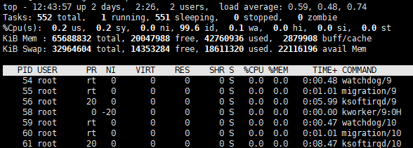
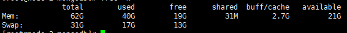
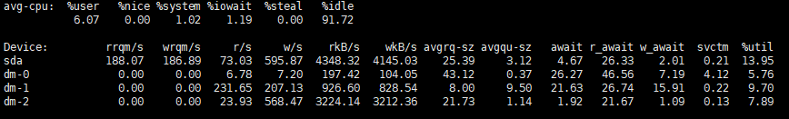

当系统运行缓慢时，需要查看是哪部分造成的，一般从CPU、内存、IO、系统负载等方面分析：
### 查看CPU占用
 `top命令`


1. 上方为系统总cpu及内存占用（`shift+E`切换内存单位）
`us`为用户进程占用的cpu
`id`为空闲cpu占用
`wa`为io等待占用的cpu
2. 下方为各进程CPU内存的占用情况（`e`切换内存单位）
`RES`为物理内存占用大小
`%MEM`为物理内存占用/总内存大小
###   查看内存占用

1.  `top`
可用内存为```available```部分，不是free
2.  `free -h`


可用内存为```available```部分,不是free
如果swap占用过多，也说明物理内存不够了。

### 查看IO占用
   `iostat -x 1 10`


每隔1秒刷新一次，共刷新10次。
如果util部分一直大于100%说明io占用过高。
###   查看系统负载(同时运行进程数)
`top`
查看```load average```部分，分别为最近1分钟，最近5分钟，最近15分钟的运行进程数，如果大于系统内核数过多说明负载过高，应该主要观察"15分钟系统负荷"，将它作为电脑正常运行的指标